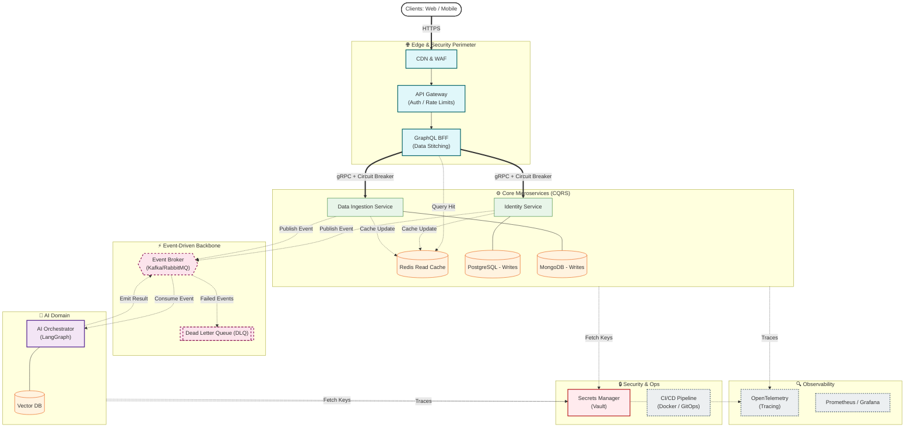

# 🏗️ Engineering Platform: Internal Developer Portal

Welcome to the central Engineering Platform. This repository serves as the Internal Developer Portal (IDP), system catalog, and architectural source of truth for my distributed ecosystem.

---

## 🗺️ High-Level Architecture

---

## 📂 Domain & Capability Catalog

Our ecosystem is divided into four primary pillars. Click into any capability to view its architectural documentation, system design, and links to the deployable code repositories.

### 1. 🌐 Web & Platform Domain

_Translating core Javascript concepts up to full Next.js platform rendering._

- **Core Engine & Performance**
  - [V8 Callstack & Memory Profiling](domains/web-platform/core-performance/v8-profiling.md)
- **Core UI Logic & Patterns**
  - [Vanilla JS Architecture & State Patterns](domains/web-platform/core-logic/js-patterns.md)
- **Design Systems & Component Libraries**
  - [Enterprise UI Library (React/Storybook)](domains/web-platform/design-systems/enterprise-ui.md)
- **Platform Applications (SSR/SSG)**
  - [Platform Portal Dashboard (Next.js)](domains/web-platform/applications/platform-portal.md)
- **Experimental Prototypes**
  - [UI Sandbox & Experiments](domains/web-platform/prototypes/ui-sandbox.md)

### 2. ⚙️ Core Services Domain

_Backend microservices ranging from API gateways to data ingestion._

- **Identity & Access Management (IAM)**
  - [Auth & JWT API Gateway (Node.js)](domains/core-services/iam/auth-gateway.md)
- **Data Routing & REST/GraphQL APIs**
  - [High-Throughput Data Service (FastAPI)](domains/core-services/data-routing/ingestion-api.md)
- **Event-Driven Architecture (EDA)**
  - [Asynchronous Task Worker (RabbitMQ/Kafka)](domains/core-services/event-driven/task-worker.md)
- **Database & Caching Strategies**
  - [Redis Caching & Rate Limiting POC](domains/core-services/data-storage/caching-strategies.md)
- **Backend Prototypes & Integrations**
  - [Serverless & API Sandbox](domains/core-services/prototypes/backend-sandbox.md)

### 3. 🧠 Intelligence Domain

_AI pipelines spanning foundational ML to autonomous agentic systems._

- **Foundational ML & NLP**
  - [Text Classification & Sentiment API](domains/intelligence/foundational/nlp-service.md)
- **Generative AI & LLM Pipelines**
  - [RAG (Retrieval-Augmented Generation) Processor](domains/intelligence/generative/rag-processor.md)
- **AI System Design & Eval**
  - [Model Evaluation & Prompt Architecture](domains/intelligence/system-design/eval-framework.md)
- **Autonomous Agents & Tool Calling**
  - [Copilot Orchestration Agent](domains/intelligence/agents/copilot-agent.md)
- **AI Prototypes & Experiments**
  - [Model Sandbox & Jupyter Notebooks](domains/intelligence/prototypes/ai-sandbox.md)

### 4. 🏛️ Architecture & System Design

_High-level system blueprints mapping directly to the enterprise concepts._

- **Frontend System Design**
  - [Micro-Frontends & Client-Side Scaling](architecture/frontend-design/scaling-strategies.md)
- **Backend System Design**
  - [Distributed Patterns & CAP Theorem](architecture/backend-design/distributed-patterns.md)
- **Architectural Core Concepts**
  - [Data Modeling & Service Boundaries](architecture/core-concepts/data-modeling.md)
- **Enterprise Strategy**
  - [Platform Vision & Tech Radar](architecture/enterprise-strategy/platform-vision.md)
- **Architecture Sandbox & ADRs**
  - [Architecture Decision Records (ADRs)](architecture/prototypes/adrs-and-drafts.md)

---

## 🛠️ Engineering Standards

All deployable repositories linked above adhere to the following platform standards:

1. **Containerization:** All services include a `Dockerfile`.
2. **CI/CD:** Automated testing and linting via GitHub Actions.
3. **Commit Convention:** Strict adherence to Conventional Commits (e.g., `feat:`, `fix:`, `chore:`).

---

## 🌍 Enterprise System Landscape (Code Repositories)

This platform operates on a strict microservice architecture. To ensure independent CI/CD lifecycles, strict decoupling, and domain isolation, the code is split across the following dedicated repositories:

- 🏢 **[@abhishekchaturvedi07/](https://github.com/abhishekchaturvedi07)** _(GitHub Organization / User)_
  - 🏗️ [**engineering-platform**](https://github.com/abhishekchaturvedi07/engineering-platform) — _(You are here)_ Architecture, System Design, and IDP Docs.
  - 💻 [**platform-portal-app**](https://github.com/abhishekchaturvedi07/platform-portal-app) — Next.js Frontend UI & GraphQL BFF layer.
  - 🔐 [**identity-service**](https://github.com/abhishekchaturvedi07/identity-service) — Node.js IAM, JWT Auth, and PostgreSQL database.
  - 🧠 [**ai-orchestrator**](https://github.com/abhishekchaturvedi07/ai-orchestrator) — Python/FastAPI LangGraph Agent & Vector processing.
