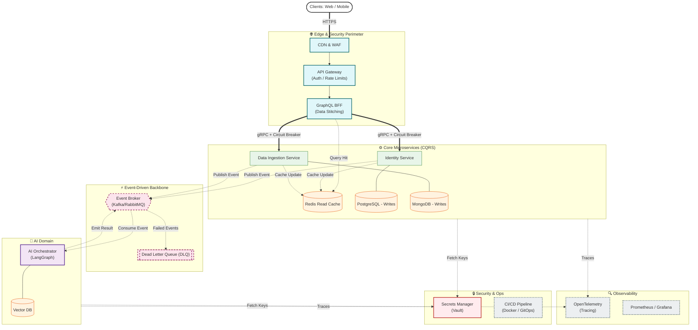

# 🏛️ Enterprise System Blueprint & Data Flow

This document outlines the high-level architectural patterns, data flow, and strict domain boundaries for the platform. It is designed for enterprise scale, incorporating resilience patterns, CQRS, and strict security perimeters.

## 1. Core Architectural Decisions

### A. Edge & API Layer

- **CDN & WAF:** Cloudflare/AWS CloudFront handles static asset caching and Web Application Firewall (WAF) rules before traffic ever hits the servers.
- **API Gateway:** A dedicated layer for SSL termination, IP filtering, and OAuth2/JWT validation.
- **GraphQL BFF:** Sits securely behind the gateway, stitching together data for the Next.js frontend to prevent over-fetching.

### B. Microservice Communication & Resilience

- **External (Sync):** Client to Gateway/BFF uses REST and GraphQL over HTTPS.
- **Internal (Sync):** Service-to-Service synchronous communication utilizes **gRPC** with Protocol Buffers for high-performance, strongly-typed contracts.
- **Resilience Patterns:** All synchronous internal calls are wrapped in **Circuit Breakers** to prevent cascading failures if a downstream service degrades.
- **Internal (Async):** A Kafka/RabbitMQ event broker handles decoupled workflows. Includes a **Dead Letter Queue (DLQ)** for failed message processing.

### C. Data Strategy & CQRS

- **Database-per-Service:** No shared databases. Identity uses PostgreSQL; Ingestion uses MongoDB.
- **CQRS (Command Query Responsibility Segregation):** Write operations (Commands) are processed and stored in primary databases. Read operations (Queries) are served primarily from **Redis**, which sits aggressively in front of all databases to handle high-throughput reads.
- **Secrets Management:** HashiCorp Vault / AWS Secrets Manager centrally manages all DB credentials and AI API keys.

### D. AI Integration: Agentic Orchestration

- **Orchestrator:** A FastAPI service powered by **LangGraph** operates as an asynchronous agent.
- **Guardrails:** Inputs and outputs pass through a security layer to check for PII and hallucination bounding before interacting with the Pinecone Vector DB.

### E. DevOps & Observability

- **CI/CD:** Automated pipelines (GitHub Actions) handle testing, containerization (Docker), and deployment.
- **Telemetry:** OpenTelemetry injects trace IDs. Logs are aggregated via ELK/Datadog, and metrics are scraped by Prometheus/Grafana.

---

## 2. System Architecture Topology

